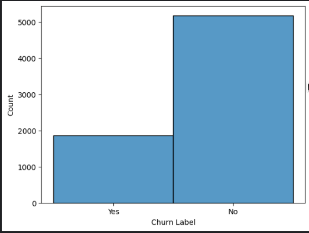
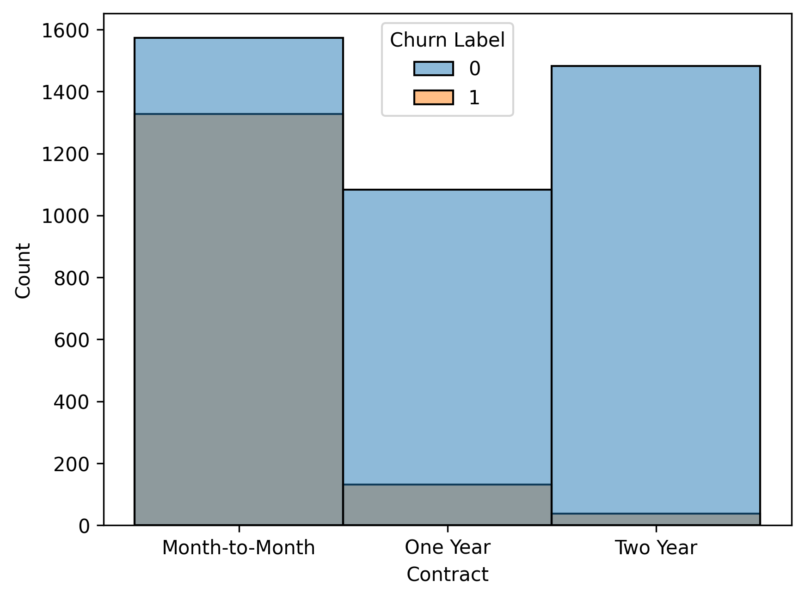
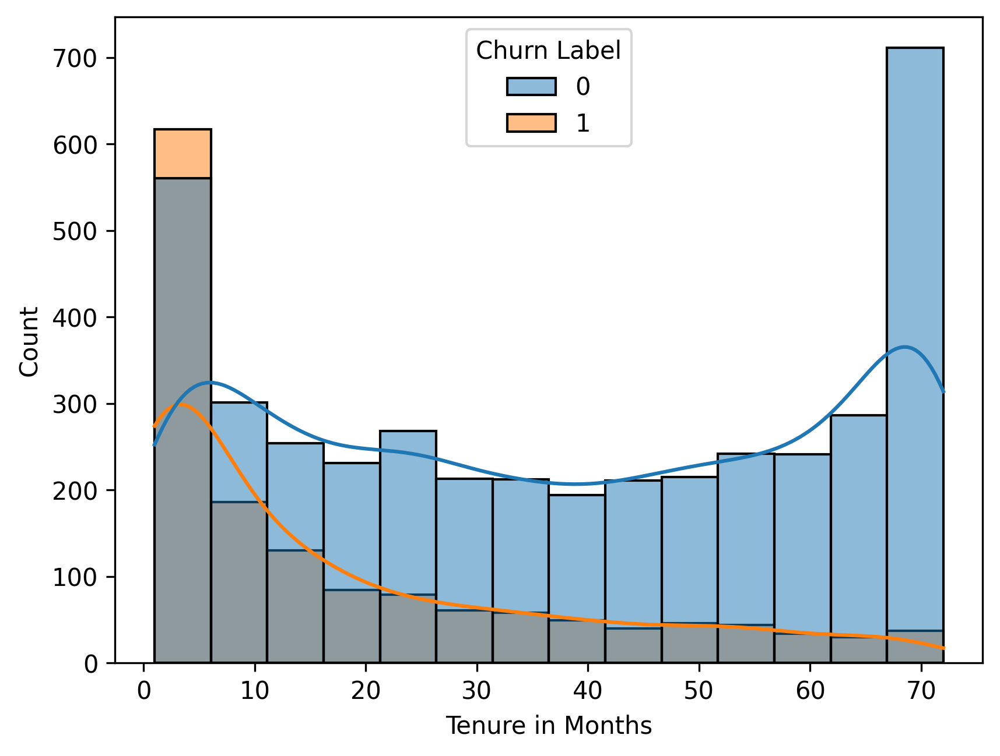
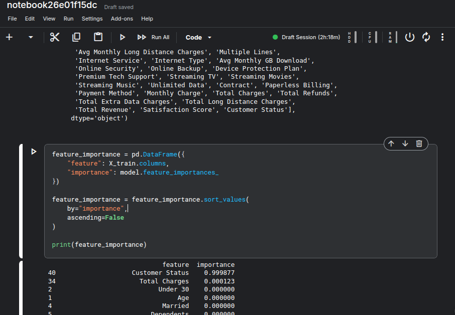
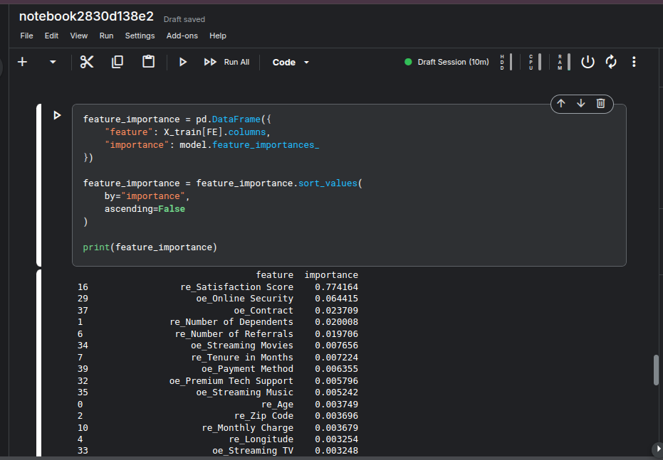

# 📊 Telco Customer Churn Prediction for Profit-Driven Retention

### End-to-End Machine Learning System for Churn Risk Scoring, Revenue Loss Estimation, and Retention Prioritization

Using data-driven insights to identify customers at risk of churn, estimate potential business impact, and support targeted retention strategies.

---

# 📌 Project Overview

Customer churn is a major business problem for telecom companies because losing customers directly reduces recurring revenue. This project builds an end-to-end machine learning system to predict customer churn risk, estimate potential revenue loss, and prioritize high-value customers for retention campaigns.

So instead of only predicting whether a customer will churn, the project focuses on converting model predictions into business decisions. The final output includes churn probability scores, expected revenue loss, customer risk segments, and retention priority recommendations.

---

# 🎯 Business Problem

Traditional churn prediction only identifies customers who are likely to leave. However, businesses also need to know which customers should be prioritized, how much revenue is at risk, and what retention actions may be appropriate. This project addresses that gap by combining churn prediction with revenue-based prioritization.

---

# 🏗 Project Architecture

```text
                        IBM Telco Dataset
                                │
                                ▼
                     Data Cleaning & Validation
                                │
                                ▼
                  Exploratory Data Analysis (EDA)
                                │
                                ▼
                  Feature Engineering & Encoding
                                │
                                ▼
                         Training Models
                                │
                                ▼
                      Model Evaluation Metrics
                                │
                                ▼
                     Churn Probability Prediction
                                │
                                ▼
                   Business Insights & Dashboard
```

---

# 📂 Dataset

This project uses the **IBM Telco Customer Churn Dataset**, a public sample dataset commonly used for customer churn analysis and machine learning classification tasks.

The dataset contains customer demographic information, account details, subscribed services, billing information, geographic attributes, and churn-related labels.

## Dataset Size

- **Records:** 7,000+ customer records
- **Features:** 50+ columns
- **Target:** `Churn Label`
- **Task:** Binary classification — predict whether a customer is likely to churn
- **Data quality:** Includes missing values and categorical variables that require preprocessing

## Feature Details

The full feature description is available in:

[`asset/feature_detail.md`](asset/feature_detail.md)

# 📊 Exploratory Data Analysis

EDA was used to identify the clearest churn patterns before modeling and turn raw data into business hypotheses.
* hypothesis can be wrong so only show clearest trend to show clearer path on train model

## Key Insights

* **Churn is not evenly distributed** — retained customers are the majority, so model evaluation should not rely on accuracy alone. Recall, F1 score, ROC-AUC, and confusion matrix are more useful for churn detection.


* **Month-to-month contracts are the highest-risk segment** — customers without long-term commitment churn much more often than customers on one-year or two-year contracts.


* **additional service decrease churn**  — customers with services like **Online Security**, **Online Backup**, **Device Protection Plan**, or **Premium Tech Support** show lower churn, suggesting these services improve customer retention.
* **Revenue features are tenure-driven** — total charges and total revenue are strongly connected to tenure, so they should be interpreted with tenure-adjusted features rather than alone.

## Business Takeaway

The highest-risk churn profile is a **new customer on a month-to-month contract, paying relatively high monthly charges, with limited support/protection services**.


These EDA findings guide feature engineering around contract type, tenure, service adoption, billing behavior, and revenue-adjusted customer value.
---

# 🤖 Machine Learning

## Data Preprocessing
The dataset was cleaned before model training to reduce leakage and prepare features.

* Target mapping: Converted Churn Label into binary values: No = 0, Yes = 1.
* Data type format: Created Internet_Service_detail from Internet Type and converted Zip Code to categorical string format.
* Dropped unused columns: Removed Customer ID, Under 30, Country, State, and Quarter.
* Dropped leakage columns: Removed Churn Score, CLTV, Churn Category, and Churn Reason,
* Update dropped leak columns :remove Customer Status and Satisfaction Score




---
## Models
### Baseline
* LogisticRegression
* Support Vector Machine (SVM),
* Random Forest
* KNN
* XGBoost 
* CatBoost
* LightBGM

### Deployment
* lgbm
---

## Evaluation Metrics
* Accuracy
* Precision
* Recall
* F1 Score
* ROC-AUC

### Primary metric:
* ROC-AUC, because it evaluates model performance across classification thresholds and is less affected by class imbalance than accuracy.

---
## 📈 Results

### short version:
| model           |   test_roc_auc |
|:----------------|---------------:|
| lgbm            |       0.925924 |
| catboost        |       0.923392 |
| xgb             |       0.922713 |
| linear_logistic |       0.918177 |
| svm_linear      |       0.916125 |
| random_forest   |       0.913288 |

### full version:


---
### Business Value Estimation

`CLTV` is not used because its calculation is not clearly defined in the dataset.
Instead, this project uses transparent business value formulas based on available columns.
For short-term, next-quarter revenue at risk is estimated as:

`Next Quarter Risk Value = Churn Probability × Monthly Charge × 3`

For ranking, given similar with short-term function with 'Tenure in Months' to make ranking:

`Ranking = Churn Probability × Monthly Charge × 3 x log(1 + Tenure in Months)`

This makes the score easier to explain than using an unclear CLTV column.

# 🚀 Installation

Clone the repository

```bash
git clone https://github.com/DHSERIES/Telco-Customer-Churn.git
```

Install dependencies

```bash
pip install -r requirements.txt
```

Run Streamlit application

```bash
streamlit streamlit_app.py
```
or run server with Fastapi
```bash
python main.py
```
---

# 📷 Screenshots

## Dashboard

```text
assets/dashboard.png
```
---

# 🔮 More Improvements

* Hyperparameter optimization across models
* features important combine with Recursive feature elimination 
* ensemble models and neuron network model include
* mlflow tracking
* Cloud deployment
* CI/CD pipeline
* Automated model retraining
---

# 🧠 Skills Demonstrated

* Data Cleaning
* Exploratory Data Analysis
* Feature Engineering
* Statistical Analysis
* Machine Learning
* Model Evaluation
* Data Visualization
* Dashboard Development
* Business Analytics

---

# ⭐ Project Highlights

* End-to-end Data Science workflow
* Business-oriented problem solving
* Interactive analytics and visualization
* Predictive Machine Learning model
* Portfolio-ready implementation
---

## License

This project is released under the MIT License and is intended for educational and portfolio purposes.


